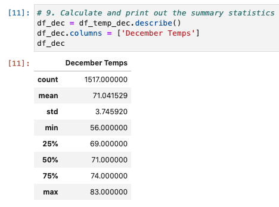

# Surfs_up

######This project will provide basic stastical information about temperature trends. Specifically, temperature data for months of June and December. 

## Overview of the analysis
#### Explain the purpose of this analysis:
The purpose of this analysis is to generate basic statistical reports regarding temperatures. Reports include the following statistical summary: count, mean, standard deviation, minimum, max, 25% 50% 75% quartiles for months of June and December. 

## Results
#### Provide a bulleted list with three major points from the two analysis deliverables. Use images as support where needed:

- Statistical report for June Temps shows there are a total of 1700 count of data. The average temperature in June is 74.94°F. The minimum temperature is 64°F, and the max temperature is 85°F

- Summary for December shows less total count of data, 1517. The average temperature is 71.05°F. While minimum temperature is 56°F, the max temperature is 83°F. 

- Comparing two summaries, we are able to state that the average temperature in June is approximately 4°F higher than December. The minimum temperature in June is, also, 8°F higher than December. 

## Summary
#### Provide a high-level summary of the results and two additional queries that you would perform to gather more weather data for June and December:

Stastical summary on days when there were absolutely no rain (prcp = 0), and compare. 

- Comparison shows that days in June had less rainy days than in December. Furthermore, the average temperature is 6°F higher in June on days without any rain. 

- Statistical summary on June temperatures with no rain days (647 data)

- Statistical summary on December temperatures with no rain days (510 data)

